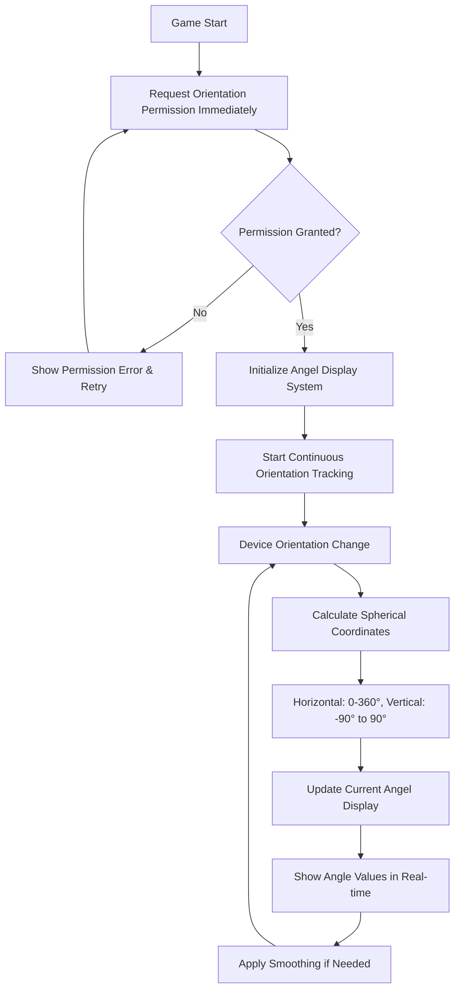

# Design Document

## Overview

The motion-based angel display system enhances the existing Phaser 3 web game by implementing a continuous orientation tracking system that displays the current angel position in real-time. The system uses device orientation APIs to track phone movement across a full spherical range (horizontal: 0-360°, vertical: -90° to 90°) and continuously updates the angel display with precise angle measurements, providing immediate visual feedback of device orientation without requiring any user interaction.

## Architecture

### Core Components

1. **OrientationManager**: Handles device orientation tracking and permission management
2. **AngelDisplaySystem**: Manages continuous angel display and angle calculations
3. **AngleCalculator**: Converts device orientation to spherical coordinates (0-360°, -90° to 90°)
4. **DisplayRenderer**: Handles real-time visual updates of the current angel with angle values

### System Flow



## Components and Interfaces

### OrientationManager

**Purpose**: Centralized management of device orientation tracking and permission handling for continuous angel display.

**Key Methods**:
- `initialize()`: Sets up orientation tracking with immediate permission request
- `requestPermissionImmediately()`: Requests orientation permission at game start
- `startContinuousTracking()`: Begins continuous orientation monitoring
- `getCurrentOrientation()`: Returns current device orientation data
- `onOrientationChange(callback)`: Registers callback for orientation updates
- `applySmoothingFilter(rawData)`: Smooths noisy orientation data

**Properties**:
- `currentOrientation`: Current device orientation (alpha, beta, gamma)
- `isPermissionGranted`: Boolean tracking permission status
- `isTracking`: Boolean tracking if continuous monitoring is active
- `smoothingFactor`: Value for orientation data smoothing (0.1-0.3)
- `updateFrequency`: Target update frequency in Hz (60fps)

### AngelDisplaySystem

**Purpose**: Manages the continuous display of the current angel with real-time angle updates.

**Key Methods**:
- `initializeDisplay()`: Sets up the angel display interface
- `updateCurrentAngel(orientation)`: Updates angel position based on device orientation
- `displayAngleValues(horizontal, vertical)`: Shows current angle measurements
- `renderAngelAtPosition(x, y)`: Renders angel sprite at calculated position

**Properties**:
- `currentAngel`: The angel sprite object being displayed
- `horizontalAngle`: Current horizontal angle (0-360°)
- `verticalAngle`: Current vertical angle (-90° to 90°)
- `displayUpdateRate`: Rate of visual updates (60fps target)

### AngleCalculator

**Purpose**: Converts device orientation data to spherical coordinates for angel positioning.

**Key Methods**:
- `calculateHorizontalAngle(alpha)`: Converts device alpha to 0-360° range
- `calculateVerticalAngle(beta)`: Converts device beta to -90° to 90° range
- `normalizeAngles(horizontal, vertical)`: Ensures angles are within valid ranges
- `handleAngleWrapAround(angle)`: Manages 360° to 0° transitions

**Properties**:
- `horizontalRange`: Valid horizontal angle range (0-360°)
- `verticalRange`: Valid vertical angle range (-90° to 90°)
- `angleResolution`: Precision of angle calculations (1° increments)

### DisplayRenderer

**Purpose**: Handles real-time visual updates and rendering of the current angel with angle information.

**Key Methods**:
- `renderAngelSprite(x, y)`: Draws angel sprite at calculated screen position
- `updateAngleDisplay(horizontal, vertical)`: Updates on-screen angle text
- `smoothPositionTransition(fromPos, toPos)`: Smoothly moves angel between positions
- `formatAngleText(angle)`: Formats angle values for display

**Properties**:
- `angelSprite`: Current angel sprite object
- `angleTextObjects`: Text objects showing current angles
- `smoothingEnabled`: Whether position smoothing is active
- `textStyle`: Styling for angle display text

## Data Models

### Current Angel Object Structure

```javascript
{
  // Spherical positioning
  horizontalAngle: 0,      // Current horizontal angle (0-360°)
  verticalAngle: 0,        // Current vertical angle (-90° to 90°)
  
  // Visual properties
  sprite: PhaserSprite,    // Phaser sprite object
  scale: 0.5,              // Current size multiplier
  
  // Screen positioning
  screenX: 0,              // Current screen X coordinate
  screenY: 0,              // Current screen Y coordinate
  isVisible: true,         // Always visible (current angel)
  alpha: 1.0,              // Current transparency
  
  // Display elements
  horizontalText: TextObject,  // Text showing horizontal angle
  verticalText: TextObject,    // Text showing vertical angle
  
  // Metadata
  name: "CurrentAngel",    // Identifier
  type: "current_angel"    // Object type
}
```

### Orientation State

```javascript
{
  // Raw device orientation data
  alpha: 0,                // Device compass heading (0-360°)
  beta: 0,                 // Device front-to-back tilt (-180° to 180°)
  gamma: 0,                // Device left-to-right tilt (-90° to 90°)
  
  // Calculated spherical coordinates
  horizontalAngle: 0,      // Processed horizontal angle (0-360°)
  verticalAngle: 0,        // Processed vertical angle (-90° to 90°)
  
  // Smoothed values
  smoothedHorizontal: 0,   // Smoothed horizontal angle
  smoothedVertical: 0,     // Smoothed vertical angle
  
  // State tracking
  isTracking: false,       // Whether orientation is being tracked
  lastUpdate: timestamp    // Last orientation update time
}
```

## Error Handling

### Permission Denied
- Display clear message explaining need for orientation access
- Provide retry button for permission request
- Fall back to touch-based rotation controls if available
- Log permission denial for analytics

### Orientation Not Supported
- Detect lack of DeviceOrientationEvent support
- Show informative message about device limitations
- Provide alternative interaction methods (touch/drag)
- Gracefully disable motion features

### Performance Issues
- Monitor frame rate during orientation updates
- Implement adaptive quality settings if performance drops
- Reduce angel count or visual effects on slower devices
- Add performance warning for users with older devices

### Data Inconsistency
- Apply smoothing filter to noisy orientation data
- Validate orientation values are within expected ranges
- Handle null/undefined orientation values gracefully
- Implement fallback positioning if orientation data is unreliable

## Testing Strategy

### Unit Tests
- **OrientationManager**: Test permission handling, continuous tracking, orientation data processing
- **AngelDisplaySystem**: Test continuous angel display updates, angle value display
- **AngleCalculator**: Test spherical coordinate conversion, angle normalization, wrap-around handling
- **DisplayRenderer**: Test real-time rendering, angle text formatting, position smoothing

### Integration Tests
- **Orientation + Display**: Test complete flow from device movement to angel display updates
- **Permission + Tracking**: Test permission request flow and continuous orientation tracking startup
- **Angle Calculation + Rendering**: Test accurate angle display with real-time updates
- **Performance**: Test frame rate maintenance with continuous updates and rapid orientation changes

### Device Testing
- **iOS Safari**: Test DeviceOrientationEvent permission flow
- **Android Chrome**: Test orientation tracking without permissions
- **Cross-platform**: Verify consistent behavior across mobile browsers
- **Orientation Changes**: Test portrait/landscape rotation handling

### User Experience Testing
- **Smooth Movement**: Verify natural feel when rotating device with continuous updates
- **Visual Feedback**: Test real-time angle value updates and angel position changes
- **Performance**: Ensure 30+ FPS during continuous orientation tracking
- **Edge Cases**: Test rapid movement, device shaking, angle wrap-around (360° to 0°), vertical extremes (-90° to 90°)